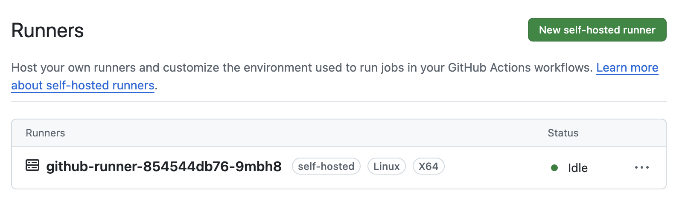
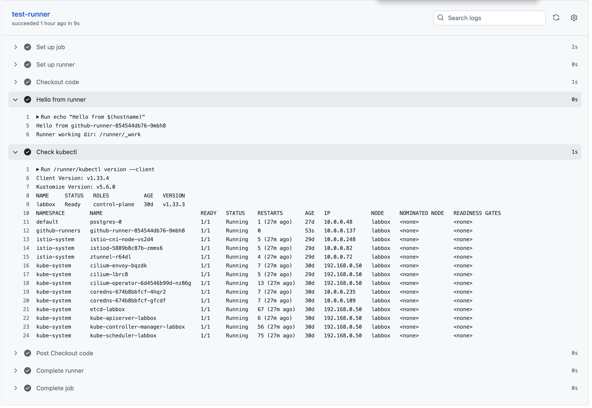

# Github Runners

We're now at the point where we can begin automation. We've proven we can use kubectl to create a pod using a moderately simple yaml file. Going forward we're going to lean more into github actions; the readme will be a basic diary of the tasks and hopefully we'll begin to build up some code.

## Enable a self hosted runner

### Github configuration

Nice and simple:

1. Go into your repo.
2. Go to settings and look for Actions > Runners on the left.
3. Click Linux and it will provide a set of instructions, in the configuration section there should be something like this:
```./config.sh --url https://github.com/tim-baker115/kubernetes_from_scratch --token <a token>```
4. Take note of the token (it's valid for one hour)!

### Make a new namespace (github-runners)

```kubectl create namespace github-runners```

Note that deleting a namespace means everything associated with it is deleted!

### Create a secret

Still quite simple, we're creating a secret called "github-runner-token" and it will be stored in the "github-runners" namespace. Replace `<a token>` with your own token from the previous step.

```kubectl create secret generic github-runner-token \
  --namespace=github-runners \
  --from-literal=RUNNER_TOKEN=<a token>
```

### Create a pod

I'm going to make a new file and drop the following into it - nothing new here, this is similar to the postgre one. Call it githubrunners.yaml

```
apiVersion: apps/v1
kind: Deployment
metadata:
  name: github-runner
  namespace: github-runners
spec:
  replicas: 1
  selector:
    matchLabels:
      app: github-runner
  template:
    metadata:
      labels:
        app: github-runner
    spec:
      containers:
      - name: runner
        image: ghcr.io/actions/actions-runner:latest  # This will eventually error... 
        env:
        - name: RUNNER_NAME
          valueFrom:
            fieldRef:
              fieldPath: metadata.name
        - name: RUNNER_REPO
          value: "tim-baker115/kubernetes_from_scratch"   # change this
        - name: RUNNER_TOKEN
          valueFrom:
            secretKeyRef:
              name: github-runner-token
              key: RUNNER_TOKEN
        - name: RUNNER_WORKDIR
          value: "_work"
```

`kubectl apply -f githubrunners.yaml`

`kubectl get pods -o wide -n github-runners`

Ok, this doesn't look good; we have it set in `ContainerCreating` for far too long:

```
root@labbox:~$ kubectl get pods -o wide -n github-runners
NAME                             READY   STATUS    RESTARTS   AGE   IP           NODE     NOMINATED NODE   READINESS GATES
github-runners   github-runner-66c86cb6bd-qtvzb     0/1     ContainerCreating   0                97s   <none>         labbox   <none>           <none>
```

Lets do some diagnostics, we're going to use a shorthand trick to get logs from the pod rather than typing out `github-runner-66c86cb6bd-qtvzb` endlessly (courtest of chatGPT):

```
root@labbox:~$ kubectl logs -f deploy/github-runner -n github-runners
Error from server (BadRequest): container "runner" in pod "github-runner-66c86cb6bd-qtvzb" is waiting to start: ContainerCreating
```

OK - that's no help at all. Let's describe the pod. We're going to refer to the label this time (another shorthand trick, describe pod is just as valid). It's worth noting that using the label will cause anything matching the label to be described:

```
root@labbox:~$ kubectl describe pod -l app=github-runner -n github-runners
Name:             github-runner-66c86cb6bd-qtvzb
Namespace:        github-runners
Priority:         0
Service Account:  default
Node:             labbox/192.168.0.50
Start Time:       Sat, 06 Sep 2025 08:43:18 +0000
Labels:           app=github-runner
                  pod-template-hash=66c86cb6bd
Annotations:      <none>
Status:           Pending
IP:               
IPs:              <none>
Controlled By:    ReplicaSet/github-runner-66c86cb6bd
Containers:
  runner:
    Container ID:   
    Image:          ghcr.io/actions/actions-runner:latest
    Image ID:       
    Port:           <none>
    Host Port:      <none>
    State:          Waiting
      Reason:       ContainerCreating
    Ready:          False
    Restart Count:  0
    Environment:
      RUNNER_NAME:     github-runner-66c86cb6bd-qtvzb (v1:metadata.name)
      RUNNER_REPO:     https://github.com/tim-baker115/kubernetes_from_scratch
      RUNNER_TOKEN:    <set to the key 'RUNNER_TOKEN' in secret 'github-runner-token'>  Optional: false
      RUNNER_WORKDIR:  _work
    Mounts:
      /var/run/secrets/kubernetes.io/serviceaccount from kube-api-access-p6dmm (ro)
Conditions:
  Type                        Status
  PodReadyToStartContainers   False 
  Initialized                 True 
  Ready                       False 
  ContainersReady             False 
  PodScheduled                True 
Volumes:
  kube-api-access-p6dmm:
    Type:                    Projected (a volume that contains injected data from multiple sources)
    TokenExpirationSeconds:  3607
    ConfigMapName:           kube-root-ca.crt
    Optional:                false
    DownwardAPI:             true
QoS Class:                   BestEffort
Node-Selectors:              <none>
Tolerations:                 node.kubernetes.io/not-ready:NoExecute op=Exists for 300s
                             node.kubernetes.io/unreachable:NoExecute op=Exists for 300s
Events:
  Type    Reason     Age    From               Message
  ----    ------     ----   ----               -------
  Normal  Scheduled  2m22s  default-scheduler  Successfully assigned github-runners/github-runner-66c86cb6bd-qtvzb to labbox
  Normal  Pulling    2m22s  kubelet            Pulling image "ghcr.io/actions/actions-runner:latest"
```

OK - last line of this is useful. To the best of my knowledge the github docker repo requires authentication; so this is hanging on the pull process. Unfortunetly there's no error (an unauthorised error would be nice?!). Let's see what free alternatives we have...  `summerwind/actions-runner:latest` that sound fine to me. I'm going to update the yaml with this and rerun. 

`kubectl apply -f githubrunners.yaml` (this file has the change mentioned previously):

```
root@labbox:~$ kubectl get pods -o wide -n github-runners
NAMESPACE        NAME                               READY   STATUS             RESTARTS       AGE   IP             NODE     NOMINATED NODE   READINESS GATES
github-runners   github-runner-66c86cb6bd-qtvzb     0/1     ContainerCreating   0                97s   <none>         labbox   <none>           <none>`
github-runners   github-runner-9465d7c9c-mrbfq      0/1     CrashLoopBackOff   3 (32s ago)    72s   10.0.0.83      labbox   <none>           <none>
```

So we now have two pods; this makes sense - we've got two different containers running. Let's have a look at the one with the CrapLoopBackOff as that's a new error:

```
root@labbox:~$ kubectl logs -f -l app=github-runner -n github-runners
2025-09-06 08:56:01.561  NOTICE --- Runner init started with pid 7
2025-09-06 08:56:01.566  DEBUG --- Working with public GitHub
2025-09-06 08:56:01.568  ERROR --- /runner should be an emptyDir mount. Please fix the pod spec.
2025-09-06 08:56:01.571  NOTICE --- Runner init exited. Exiting this process with code 0 so that the container and the pod is GC'ed Kubernetes soon.
```

This error implies that the mount point is wrong, I imagine it's using / or something by default. I'm going to add a directory ro my yaml file to fix it:

```
        - name: RUNNER_WORKDIR
          value: "/runner/_work"
        volumeMounts:
        - name: runner-workdir
          mountPath: /runner
      volumes:
      - name: runner-workdir
        emptyDir: {}

```
root@labbox:~$ kubectl get pods -o wide -n github-runners
github-runners   github-runner-66c86cb6bd-qtvzb     0/1     ContainerCreating   0                97s   <none>         labbox   <none>           <none>`
github-runners   github-runner-6bcdc8658d-qwhqp     1/1     Running   0              4s    10.0.0.73      labbox   <none>           <none>
```

Lets delete the other pod now:
```kubectl delete pod github-runner-66c86cb6bd-qtvzb -n github-runners```

### Create a github action

Firstly, go into github in the actions panel found previously you should have your pod listed (miniscule sense of achievement - woohoo).



Next we're going to create a really simple workflow, literally someone which just describes the pods; this should go in your root directory under `.github/workflows/<a name.yml>`. You should be able to see mine in the repo:

```
name: Kubernetes Test

on:
  push:
    branches:
      - main

jobs:
  test-runner:
    runs-on: self-hosted   # this tells GitHub to use your runner
    steps:
      - name: Checkout code
        uses: actions/checkout@v3

      - name: Show environment
        run: |
          echo "Hello from $(hostname)"
          echo "Runner working dir: $RUNNER_WORKDIR"
          kubectl get nodes
```

Now when you push this it should run these commands; the aim being that going forward we execute yaml files automatically (this is just an example for the timebeing)...

Except we have an error in github now.

```
Run echo "Hello from $(hostname)" 
Hello from github-runner-6bcdc8658d-qwhqp 
Runner working dir: /runner/_work /runner/_work/_temp/e170cc6b-e0bf-4f15-9609-5e1ed0b8ff22.sh: 
line 3: kubectl: command not found Error: Process completed with exit code 127.
```
So this has an error when running kubectl, there's no binary for that. That makes sense, why would there be? We'll add a sidecar into the pod to include kubectl. That's what I'd usually do... but there's also [init-container](https://kubernetes.io/docs/concepts/workloads/pods/init-containers/) which will execute before the container and provide the tools needed. Unlike a sidecar it doesn't run continually. Interesting concept. So under the spec we'll add this:

```
    spec:
      initContainers:
      - name: install-kubectl
        image: bitnami/kubectl:latest
        command:
          - sh
          - -c
          - |
            cp /opt/bitnami/kubectl/bin/kubectl /runner
        volumeMounts:
        - name: runner-workdir
          mountPath: /runner
```
This will copy kubectl using a free image into the /runner folder. My yaml file is now complete and no further changes will be applied to it [githubrunner.yaml](../manifests/githubrunner/githubrunner.yaml).

Apply this as we have done previously (literally overwrite the file), it may stick in `PodInitializing` a little longer. Use describe pods to view status.

OK. I'm going to push a change to github now and see what happens...

```
Run /runner/kubectl version --client Client Version: v1.33.4 Kustomize Version: v5.6.0 
Error from server (Forbidden): nodes is forbidden: User "system:serviceaccount:github-runners:default" cannot list resource "nodes" in API group "" at the cluster scope Error: Process completed with exit code 1.
```

This is a permission thing. We're going to make a `ClusterRole` and a `ClusterRoleBinding` first the ClusterRole:

```
apiVersion: rbac.authorization.k8s.io/v1
kind: ClusterRole
metadata:
  name: github-runner-cluster-role
rules:
- apiGroups: [""]
  resources: ["nodes", "pods", "services", "namespaces"]
  verbs: ["get", "list", "watch", "create", "delete", "update"]
```

Literally all we're doing here is allowing the role (github-runner-cluster-role) access to resources (nodes, pods, services and namespaces) with the ability to run commands like (get, list, watch, create, delete and update).

Now the ClusterRole:

```
apiVersion: rbac.authorization.k8s.io/v1
kind: ClusterRoleBinding
metadata:
  name: github-runner-crb
roleRef:
  apiGroup: rbac.authorization.k8s.io
  kind: ClusterRole
  name: github-runner-cluster-role
subjects:
- kind: ServiceAccount
  name: default
  namespace: github-runners
```

We're going to gibe it a name, then a reference point (this matches the previous yaml file) then the "thing" it applies to, in this case we're making a ServiceAccount and applying it to the github-runners namespace. We can either add these bits of yaml to the file or have them execute seperately. I've seperated them to make it easier to follow.

[githubrunner.yaml](../manifests/githubrunner/githubrunner.yaml)

[githubrunner-rbac.yaml](../manifests/githubrunner/githubrunner-rbac.yaml)

Apply the rbac role as we have done previously: 

`kubectl apply -f githubrunner-rbac.yaml`

It's worth noting at this point the pod will need to be restarted to apply these changes, a delete will do that

`kubectl delete pod -l app=github-runner -n github-runners`

Now when we apply new changes we get some output!

